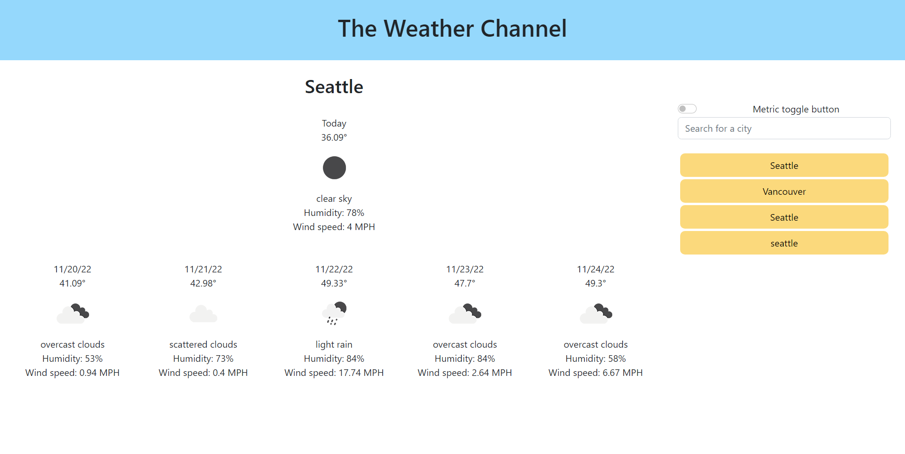

# Weather Application

## Description

A weather application that uses the OpenWeather API to get the current weather, as well as the next 5 days of the weekly forecast.

## Installation

N/A

## Usage

Use the search bar to begin searching cities.
Visit the deployed application [here](https://tkmarsten.github.io/weather-app)

## Contribution

Tiarnan Marsten

## License

